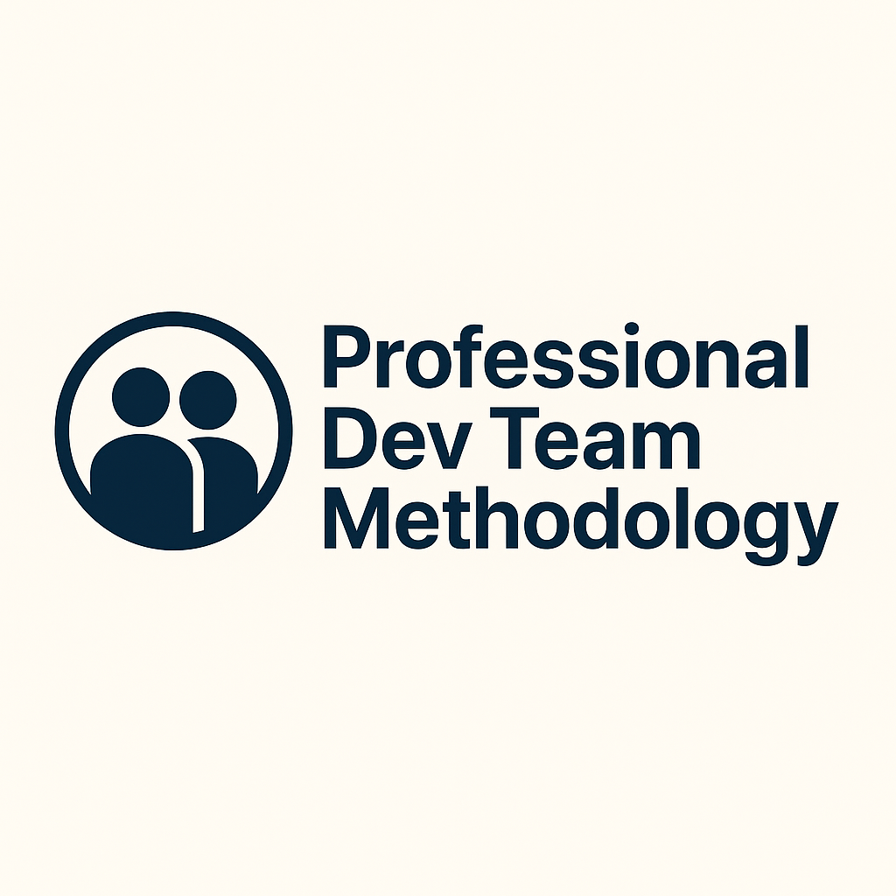

<h1>👥 Professional Dev Team Methodology</h1>

<p align="center">
    
</p>

<h3><em>Build high-quality software with structured team collaboration.</em></h3>

<p align="center">
    <strong>A professional development team methodology that combines specifications
    with team personas for optimal collaboration and outcomes.</strong>
</p>

<p align="center">
    <a href="https://github.com/Nom-nom-hub/dev-team-methodology/actions/workflows/release.yml">
        
    </a>
    <a href="https://github.com/Nom-nom-hub/dev-team-methodology/stargazers">
        
    </a>
    <a href="https://github.com/Nom-nom-hub/dev-team-methodology/blob/main/LICENSE">
        
    </a>
    <a href="https://github.com/Nom-nom-hub/dev-team-methodology/tree/main/docs">
        
    </a>
</p>

## Table of Contents

- [🤔 What is Professional Team-Driven Development?](#-what-is-professional-team-driven-development)
- [⚡ Get Started](#-get-started)
- [🤖 Supported AI Agents](#-supported-ai-agents)
- [🔧 Team CLI Reference](#-team-cli-reference)
- [📚 Core Philosophy](#-core-philosophy)
- [👥 Team Personas](#-team-personas)
- [🎯 Development Phases](#-development-phases)
- [🔧 Prerequisites](#-prerequisites)
- [📖 Learn More](#-learn-more)
- [📋 Detailed Process](#detailed-process)
- [🔍 Troubleshooting](#-troubleshooting)
- [👥 Maintainers](#-maintainers)
- [💬 Support](#-support)
- [🙏 Acknowledgements](#-acknowledgements)
- [📄 License](#-license)

## 🤔 What is Professional Team-Driven Development?

Professional Team-Driven Development combines the best of Spec-Driven Development with professional team collaboration
practices. It recognizes that high-quality software is built not just with good specifications and processes, but
through the collaboration of specialized team personas working together effectively.

In this methodology, specifications remain the primary artifact, but are developed through team collaboration where each
persona contributes their expertise. The approach ensures that technical, design, business, and quality perspectives are
all considered during the specification phase, leading to more robust and implementable requirements.

## ⚡ Get Started

### 1. Install Team CLI

Choose your preferred installation method:

#### Option 1: Persistent Installation (Recommended)

Install once and use everywhere:

```bash
uv tool install team-cli --from git+https://github.com/Nom-nom-hub/dev-team-methodology.git
```

Then use the tool directly:

```bash
# Create new project
team init <PROJECT_NAME>

# Or initialize in existing project
team init . --ai claude
# or
team init --here --ai claude

# Check installed tools
team check
```

To upgrade Team CLI, see the [Upgrade Guide](./docs/upgrade.md) for detailed instructions. Quick upgrade:

```bash
uv tool install team-cli --force --from git+https://github.com/Nom-nom-hub/dev-team-methodology.git
```

#### Option 2: One-time Usage

Run directly without installing:

```bash
uvx --from git+https://github.com/Nom-nom-hub/dev-team-methodology.git team init <PROJECT_NAME>
```

**Benefits of persistent installation:**

- Tool stays installed and available in PATH
- No need to create shell aliases
- Better tool management with `uv tool list`, `uv tool upgrade`, `uv tool uninstall`
- Cleaner shell configuration

### 2. Establish team principles

Launch your AI assistant in the project directory. The `/team.*` commands are available in the assistant.

Use the **`/team.constitution`** command to create your project's governing principles and development guidelines that
will guide all subsequent development.

```bash
/team.constitution Create principles focused on code quality, testing standards, user experience consistency, and performance requirements. Define team roles and responsibilities.
```

### 3. Review team personas

Use the **`/team.personas`** command to review and understand the six standard team personas that contribute to the development
process.

```bash
/team.personas
```

### 4. Create the spec collaboratively

Use the **`/team.specify`** command to describe what you want to build. Focus on the **what** and **why**, not the tech
stack.

```bash
/team.specify Build an application that can help me organize my photos in separate photo albums. Albums are grouped by date and can be re-organized by dragging and dropping on the main page. Albums are never in other nested albums. Within each album, photos are previewed in a tile-like interface.
```

### 5. Review and validate with team perspectives

Use the **`/team.review`** command to have each team persona examine the specification from their perspective.

```bash
/team.review Have each team persona review the specification: Product Manager checks for user value and completeness, Technical Architect assesses feasibility, UX Designer evaluates user experience, QA considers testability, Developer reviews implementation complexity, DevOps Engineer evaluates deployment and operational requirements.
```

### 6. Create a technical implementation plan

Use the **`/team.plan`** command to provide your tech stack and architecture choices, considering input from all team
personas.

```bash
/team.plan The application uses Vite with minimal number of libraries. Use vanilla HTML, CSS, and JavaScript as much as possible. Images are not uploaded anywhere and metadata is stored in a local SQLite database. Consider scalability, security, and maintainability requirements from all team perspectives.
```

### 7. Break down into tasks

Use **`/team.tasks`** to create an actionable task list from your implementation plan, with clear ownership by team
personas.

```bash
/team.tasks
```

### 8. Execute implementation

Use **`/team.implement`** to execute all tasks and build your feature according to the plan, with team persona
collaboration.

```bash
/team.implement
```

For detailed step-by-step instructions, see our [comprehensive guide](./team-driven.md).

## 🤖 Supported AI Agents

| Agent                                                                                | Support | Notes                                                                                                                                     |
| ------------------------------------------------------------------------------------ | ------- | ----------------------------------------------------------------------------------------------------------------------------------------- |
| [Qoder CLI](https://qoder.com/cli)                                                   | ✅      |                                                                                                                                           |
| [Amazon Q Developer CLI](https://aws.amazon.com/developer/learning/q-developer-cli/) | ⚠️      | Amazon Q Developer CLI [does not support](https://github.com/aws/amazon-q-developer-cli/issues/3064) custom arguments for slash commands. |
| [Amp](https://ampcode.com/)                                                          | ✅      |                                                                                                                                           |
| [Auggie CLI](https://docs.augmentcode.com/cli/overview)                              | ✅      |                                                                                                                                           |
| [Claude Code](https://www.anthropic.com/claude-code)                                 | ✅      |                                                                                                                                           |
| [CodeBuddy CLI](https://www.codebuddy.ai/cli)                                        | ✅      |                                                                                                                                           |
| [Codex CLI](https://github.com/openai/codex)                                         | ✅      |                                                                                                                                           |
| [Cursor](https://cursor.sh/)                                                         | ✅      |                                                                                                                                           |
| [Gemini CLI](https://github.com/google-gemini/gemini-cli)                            | ✅      |                                                                                                                                           |
| [GitHub Copilot](https://code.visualstudio.com/)                                     | ✅      |                                                                                                                                           |
| [IBM Bob](https://www.ibm.com/products/bob)                                          | ✅      | IDE-based agent with slash command support                                                                                                |
| [Jules](https://jules.google.com/)                                                   | ✅      |                                                                                                                                           |
| [Kilo Code](https://github.com/Kilo-Org/kilocode)                                    | ✅      |                                                                                                                                           |
| [opencode](https://opencode.ai/)                                                     | ✅      |                                                                                                                                           |
| [Qwen Code](https://github.com/QwenLM/qwen-code)                                     | ✅      |                                                                                                                                           |
| [Roo Code](https://roocode.com/)                                                     | ✅      |                                                                                                                                           |
| [SHAI (OVHcloud)](https://github.com/ovh/shai)                                       | ✅      |                                                                                                                                           |
| [Windsurf](https://windsurf.com/)                                                    | ✅      |                                                                                                                                           |

## 🔧 Team CLI Reference

The `team` command supports the following options:

### Commands

| Command | Description                                                                                                                                             |
| ------- | ------------------------------------------------------------------------------------------------------------------------------------------------------- |
| `init`  | Initialize a new Team project from the latest template                                                                                                  |
| `check` | Check for installed tools (`git`, `claude`, `gemini`, `code`/`code-insiders`, `cursor-agent`, `windsurf`, `qwen`, `opencode`, `codex`, `shai`, `qoder`) |

### `team init` Arguments & Options

| Argument/Option        | Type     | Description                                                                                                                                                                                  |
| ---------------------- | -------- | -------------------------------------------------------------------------------------------------------------------------------------------------------------------------------------------- |
| `<project-name>`       | Argument | Name for your new project directory (optional if using `--here`, or use `.` for current directory)                                                                                           |
| `--ai`                 | Option   | AI assistant to use: `claude`, `gemini`, `copilot`, `cursor-agent`, `qwen`, `opencode`, `codex`, `windsurf`, `kilocode`, `auggie`, `roo`, `codebuddy`, `amp`, `shai`, `q`, `bob`, or `qoder` |
| `--script`             | Option   | Script variant to use: `sh` (bash/zsh) or `ps` (PowerShell)                                                                                                                                  |
| `--ignore-agent-tools` | Flag     | Skip checks for AI agent tools like Claude Code                                                                                                                                              |
| `--no-git`             | Flag     | Skip git repository initialization                                                                                                                                                           |
| `--here`               | Flag     | Initialize project in the current directory instead of creating a new one                                                                                                                    |
| `--force`              | Flag     | Force merge/overwrite when initializing in current directory (skip confirmation)                                                                                                             |
| `--skip-tls`           | Flag     | Skip SSL/TLS verification (not recommended)                                                                                                                                                  |
| `--debug`              | Flag     | Enable detailed debug output for troubleshooting                                                                                                                                             |
| `--github-token`       | Option   | GitHub token for API requests (or set GH_TOKEN/GITHUB_TOKEN env variable)                                                                                                                    |

### Examples

```bash
# Basic project initialization
team init my-project

# Initialize with specific AI assistant
team init my-project --ai claude

# Initialize with Cursor support
team init my-project --ai cursor-agent

# Initialize with Qoder support
team init my-project --ai qoder

# Initialize with Windsurf support
team init my-project --ai windsurf

# Initialize with Amp support
team init my-project --ai amp

# Initialize with SHAI support
team init my-project --ai shai

# Initialize with IBM Bob support
team init my-project --ai bob

# Initialize with PowerShell scripts (Windows/cross-platform)
team init my-project --ai copilot --script ps

# Initialize in current directory
team init . --ai copilot
# or use the --here flag
team init --here --ai copilot

# Force merge into current (non-empty) directory without confirmation
team init . --force --ai copilot
# or 1
team init --here --force --ai copilot

# Skip git initialization
team init my-project --ai gemini --no-git

# Enable debug output for troubleshooting
team init my-project --ai claude --debug

# Use GitHub token for API requests (helpful for corporate environments)
team init my-project --ai claude --github-token ghp_your_token_here

# Check system requirements
team check
```

### Available Slash Commands

After running `team init`, your AI coding agent will have access to these slash commands for structured team-based
development:

#### Core Commands

Essential commands for the Team-Driven Development workflow:

| Command              | Description                                                                   |
| -------------------- | ----------------------------------------------------------------------------- |
| `/team.constitution` | Create or update project governing principles and development guidelines      |
| `/team.personas`     | Define the professional team personas and their responsibilities              |
| `/team.specify`      | Define what you want to build (requirements and user stories) with team input |
| `/team.review`       | Review specifications from each team persona's perspective                    |
| `/team.plan`         | Create technical implementation plans with input from all team personas       |
| `/team.tasks`        | Generate actionable task lists with team persona ownership                    |
| `/team.implement`    | Execute all tasks to build the feature with team collaboration                |

#### Optional Commands

Additional commands for enhanced quality and validation:

| Command           | Description                                                                                                                          |
| ----------------- | ------------------------------------------------------------------------------------------------------------------------------------ |
| `/team.clarify`   | Clarify underspecified areas from team perspective (recommended before `/team.plan`; formerly `/quizme`)                             |
| `/team.analyze`   | Cross-artifact consistency & coverage analysis from all team perspectives (run after `/team.tasks`, before `/team.implement`)        |
| `/team.checklist` | Generate custom quality checklists that validate requirements completeness, clarity, and consistency (like "unit tests for English") |

### Environment Variables

| Variable       | Description                                                                                                                                                                                                                                                                                         |
| -------------- | --------------------------------------------------------------------------------------------------------------------------------------------------------------------------------------------------------------------------------------------------------------------------------------------------- |
| `TEAM_FEATURE` | Override feature detection for non-Git repositories. Set to the feature directory name (e.g., `001-photo-albums`) to work on a specific feature when not using Git branches.<br/>\*\*Must be set in the context of the agent you're working with prior to using `/team.plan` or follow-up commands. |

## 📚 Core Philosophy

Team-Driven Development is a structured process that emphasizes:

- **Team collaboration first**: Specifications are developed with input from all team personas
- **Intent-driven development** where specifications define the "*what*" before the "*how*"
- **Rich specification creation** using guardrails and organizational principles
- **Multi-step refinement** rather than one-shot code generation from prompts
- **Heavy reliance** on advanced AI model capabilities for specification interpretation and team coordination

## 👥 Team Personas

The methodology defines six key professional team personas that contribute to the development process:

### Product Manager

- **Focus**: User value, business requirements, market validation
- **Responsibilities**: Define user stories, success metrics, feature priorities, and market fit
- **Key contributions**: Ensure the right thing is being built for users

### Technical Architect

- **Focus**: System design, architecture decisions, technical feasibility
- **Responsibilities**: Architecture patterns, technology choices, performance, scalability
- **Key contributions**: Ensure the solution is technically sound and scalable

### UX Designer

- **Focus**: User experience, interface design, accessibility
- **Responsibilities**: User flows, visual design, usability, accessibility compliance
- **Key contributions**: Ensure the solution provides great user experience

### Quality Assurance

- **Focus**: Testing strategy, quality metrics, risk assessment
- **Responsibilities**: Test plans, quality gates, bug prevention, quality metrics
- **Key contributions**: Ensure the solution meets quality standards

### Developer

- **Focus**: Implementation, code quality, technical execution
- **Responsibilities**: Code implementation, unit testing, refactoring, code reviews
- **Key contributions**: Build the solution effectively and efficiently

### DevOps Engineer

- **Focus**: Infrastructure, deployment, monitoring, operational excellence
- **Responsibilities**: CI/CD, deployment, monitoring, security, scalability
- **Key contributions**: Ensure the solution can be deployed and maintained reliably

## 🎯 Development Phases

| Phase                                    | Focus                    | Key Activities                                                                                                                                                                                                                        |
| ---------------------------------------- | ------------------------ | ------------------------------------------------------------------------------------------------------------------------------------------------------------------------------------------------------------------------------------- |
| **0-to-1 Development** ("Greenfield")    | Generate from scratch    | <ul><li>Start with high-level requirements</li><li>Generate specifications with team input</li><li>Plan implementation steps from multiple perspectives</li><li>Build production-ready applications with team collaboration</li></ul> |
| **Creative Exploration**                 | Parallel implementations | <ul><li>Explore diverse solutions from different team perspectives</li><li>Support multiple technology stacks & architectures</li><li>Experiment with UX patterns with designer input</li></ul>                                       |
| **Iterative Enhancement** ("Brownfield") | Brownfield modernization | <ul><li>Add features iteratively with team input</li><li>Modernize legacy systems with architect and DevOps input</li><li>Adapt processes based on team feedback</li></ul>                                                            |

## 🔧 Prerequisites

- **Linux/macOS/Windows**
- [Supported](#-supported-ai-agents) AI coding agent.
- [uv](https://docs.astral.sh/uv/) for package management
- [Python 3.11+](https://www.python.org/downloads/)
- [Git](https://git-scm.com/downloads)

If you encounter issues with an agent, please open an issue so we can refine the integration.

## 📖 Learn More

### Getting Started
- **[Quick Start Guide](./docs/QUICK-START.md)** - 5-minute setup guide
- **[FAQ](./docs/FAQ.md)** - Common questions and answers
- **[Troubleshooting](./docs/TROUBLESHOOTING.md)** - Solutions for common issues

### Deep Dives
- **[Complete Team-Driven Development Methodology](./team-driven.md)** - Full philosophy and principles
- **[Agent Capabilities Comparison](./docs/AGENT-CAPABILITIES.md)** - Which agent for which task
- **[Detailed Walkthrough](#detailed-process)** - Step-by-step implementation guide

### Detailed Process

<details>
<summary>Click to expand the detailed step-by-step walkthrough</summary>

You can use the Team CLI to bootstrap your project, which will bring in the required artifacts in your environment. Run:

```bash
team init <project_name>
```

Or initialize in the current directory:

```bash
team init .
# or use the --here flag 1
team init --here
# Skip confirmation when the directory already has files
team init . --force
# or 2
team init --here --force
```

You will be prompted to select the AI agent you are using. You can also proactively specify it directly in the terminal:

```bash
team init <project_name> --ai claude
team init <project_name> --ai gemini
team init <project_name> --ai copilot

# Or in current directory:
team init . --ai claude
team init . --ai codex

# or use --here flag
team init --here --ai claude
team init --here --ai codex

# Force merge into a non-empty current directory
team init . --force --ai claude

# or 3
team init --here --force --ai claude
```

The CLI will check if you have Claude Code, Gemini CLI, Cursor CLI, Qwen CLI, opencode, Codex CLI, Qoder CLI, or Amazon
Q Developer CLI installed. If you do not, or you prefer to get the templates without checking for the right tools, use
`--ignore-agent-tools` with your command:

```bash
team init <project_name> --ai claude --ignore-agent-tools
```

### **STEP 1:** Establish project principles

Go to the project folder and run your AI agent. In our example, we're using `claude`.

You will know that things are configured correctly if you see the `/team.constitution`, `/team.personas`,
`/team.specify`, `/team.review`, `/team.plan`, `/team.tasks`, and `/team.implement` commands available.

The first step should be establishing your project's governing principles using the `/team.constitution` command. This
helps ensure consistent decision-making throughout all subsequent development phases:

```text
/team.constitution Create principles focused on code quality, testing standards, user experience consistency, and performance requirements. Include governance for how these principles should guide technical decisions and implementation choices.
```

This step creates or updates the `.team/memory/constitution.md` file with your project's foundational guidelines that
the AI agent will reference during specification, planning, and implementation phases.

### **STEP 2:** Review team personas

With your project principles established, review the six standard team personas that will contribute to the development
process. Use the `/team.personas` command to understand the roles, responsibilities, and perspectives of each team member:

```text
/team.personas
```

This explains the `.team/personas/` directory with detailed descriptions for each persona, their focus areas, and how
they contribute to the development process.

### **STEP 3:** Create project specifications collaboratively

With your project principles and team personas established, you can now create the functional specifications with input
from all team personas. Use the `/team.specify` command and then provide the concrete requirements for the project you
want to develop.

> [!IMPORTANT] Be as explicit as possible about *what* you are trying to build and *why*. **Do not focus on the tech
> stack at this point**.

An example prompt:

```text
Develop Taskify, a team productivity platform. It should allow users to create projects, add team members,
assign tasks, comment and move tasks between boards in Kanban style. In this initial phase for this feature,
let's call it "Create Taskify," let's have multiple users but the users will be declared ahead of time, predefined.
I want five users in two different categories, one product manager and four engineers. Let's create three
different sample projects. Let's have the standard Kanban columns for the status of each task, such as "To Do,"
"In Progress," "In Review," and "Done." There will be no login for this application as this is just the very
first testing thing to ensure that our basic features are set up. For each task in the UI for a task card,
you should be able to change the current status of the task between the different columns in the Kanban work board.
You should be able to leave an unlimited number of comments for a particular card. You should be able to, from that task
card, assign one of the valid users. When you first launch Taskify, it's going to give you a list of the five users to pick
from. There will be no p...
```

After this prompt is entered, you should see Claude Code kick off the planning and spec drafting process from a team
perspective. Claude Code will also trigger some of the built-in scripts to set up the repository.

Once this step is completed, you should have a new branch created (e.g., `001-create-taskify`), as well as a new
specification in the `specs/001-create-taskify` directory.

The produced specification should contain a set of user stories and functional requirements, as defined in the template,
with consideration for all team persona perspectives.

At this stage, your project folder contents should resemble the following:

```text
└── .team
    ├── memory
    │  └── constitution.md
    ├── personas
    │  ├── product-manager.md
    │  ├── technical-architect.md
    │  ├── ux-designer.md
    │  ├── quality-assurance.md
    │  ├── developer.md
    │  └── devops-engineer.md
    ├── scripts
    │  ├── check-prerequisites.sh
    │  ├── common.sh
    │  ├── create-new-feature.sh
    │  ├── setup-plan.sh
    │  └── update-claude-md.sh
    ├── specs
    │  └── 001-create-taskify
    │      └── spec.md
    └── templates
        ├── plan-template.md
        ├── spec-template.md
        └── tasks-template.md
```

### **STEP 4:** Review and validate from team perspectives

With the baseline specification created, each team persona should review the specification from their perspective. You
can use the `/team.review` command to have each persona examine the specification:

```text
/team.review Have each team persona review the specification: Product Manager checks for user value and completeness, Technical Architect assesses feasibility, UX Designer evaluates user experience, QA considers testability, Developer reviews implementation complexity, DevOps Engineer evaluates deployment and operational requirements.
```

This step ensures that all critical perspectives are considered before moving to the planning phase.

### **STEP 5:** Functional specification clarification (required before planning)

With the baseline specification created and reviewed from team perspectives, you can go ahead and clarify any of the
requirements that were not captured properly within the first shot attempt.

You should run the structured clarification workflow **before** creating a technical plan to reduce rework downstream.

Preferred order:

1. Use `/team.clarify` (structured) – sequential, coverage-based questioning that records answers in a Clarifications
   section.
1. Optionally follow up with ad-hoc free-form refinement if something still feels vague.

If you intentionally want to skip clarification (e.g., spike or exploratory prototype), explicitly state that so the
agent doesn't block on missing clarifications.

Example free-form refinement prompt (after `/team.clarify` if still needed):

```text
For each sample project or project that you create there should be a variable number of tasks between 5 and 15
tasks for each one randomly distributed into different states of completion. Make sure that there's at least
one task in each stage of completion.
```

You should also ask Claude Code to validate the **Review & Acceptance Checklist**, checking off the things that are
validated/pass the requirements, and leave the ones that are not unchecked. The following prompt can be used:

```text
Read the review and acceptance checklist, and check off each item in the checklist if the feature spec meets the criteria. Leave it empty if it does not.
```

It's important to use the interaction with Claude Code as an opportunity to clarify and ask questions around the
specification - **do not treat its first attempt as final**.

### **STEP 6:** Generate a plan with team input

You can now be specific about the tech stack and other technical requirements, considering input from all team personas.
You can use the `/team.plan` command that is built into the project template with a prompt like this:

```text
We are going to generate this using .NET Aspire, using Postgres as the database. The frontend should use
Blazor server with drag-and-drop task boards, real-time updates. There should be a REST API created with a projects API,
tasks API, and a notifications API. Consider the scalability requirements from the Architect, the security needs from QA,
the deployment strategy from DevOps, and the user experience from the UX Designer.
```

The output of this step will include a number of implementation detail documents, with your directory tree resembling
this:

```text
.
├── CLAUDE.md
├── memory
│  └── constitution.md
├── personas
│  ├── product-manager.md
│  ├── technical-architect.md
│  ├── ux-designer.md
│  ├── quality-assurance.md
│  ├── developer.md
│  └── devops-engineer.md
├── scripts
│  ├── check-prerequisites.sh
│  ├── common.sh
│  ├── create-new-feature.sh
│  ├── setup-plan.sh
│  └── update-claude-md.sh
├── specs
│  └── 001-create-taskify
│      ├── contracts
│      │  ├── api-spec.json
│      │  └── signalr-spec.md
│      ├── data-model.md
│      ├── plan.md
│      ├── quickstart.md
│      ├── research.md
│      └── spec.md
└── templates
    ├── CLAUDE-template.md
    ├── plan-template.md
    ├── spec-template.md
    └── tasks-template.md
```

Check the `research.md` document to ensure that the right tech stack is used, based on your instructions. You can ask
Claude Code to refine it if any of the components stand out, or even have it check the locally-installed version of the
platform/framework you want to use (e.g., .NET).

Additionally, you might want to ask Claude Code to research details about the chosen tech stack if it's something that
is rapidly changing (e.g., .NET Aspire, JS frameworks), with a prompt like this:

```text
I want you to go through the implementation plan and implementation details, looking for areas that could
benefit from additional research as .NET Aspire is a rapidly changing library. For those areas that you identify that
require further research, I want you to update the research document with additional details about the specific
versions that we are going to be using in this Taskify application and spawn parallel research tasks to clarify
any details using research from the web.
```

During this process, you might find that Claude Code gets stuck researching the wrong thing - you can help nudge it in
the right direction with a prompt like this:

```text
I think we need to break this down into a series of steps. First, identify a list of tasks
that you would need to do during implementation that you're not sure of or would benefit
from further research. Write down a list of those tasks. And then for each one of these tasks,
I want you to spin up a separate research task so that the net results is we are researching
all of those very specific tasks in parallel. What I saw you doing was it looks like you were
researching .NET Aspire in general and I don't think that's gonna do much for us in this case.
That's way too untargeted research. The research needs to help you solve a specific targeted question.
```

> [!NOTE] Claude Code might be over-eager and add components that you did not ask for. Ask it to clarify the rationale
> and the source of the change.

### **STEP 7:** Have Claude Code validate the plan from team perspectives

With the plan in place, you should have Claude Code run through it to make sure that there are no missing pieces from
different team perspectives. You can use a prompt like this:

```text
Now I want you to go and audit the implementation plan and the implementation detail files
from each team persona perspective:
- Product Manager: Is this plan likely to deliver user value?
- Technical Architect: Is this architecture sound and scalable?
- UX Designer: Will this plan result in good user experience?
- QA: Is there enough planning for quality and testing?
- Developer: Is this implementation approach practical?
- DevOps: Is there proper planning for deployment and operations?
```

This helps refine the implementation plan and helps you avoid potential blind spots that Claude Code missed in its
planning cycle. Once the initial refinement pass is complete, ask Claude Code to go through the checklist once more
before you can get to the implementation.

You can also ask Claude Code (if you have the [GitHub CLI](https://docs.github.com/en/github-cli/github-cli) installed)
to go ahead and create a pull request from your current branch to `main` with a detailed description, to make sure that
the effort is properly tracked.

> [!NOTE] Before you have the agent implement it, it's also worth prompting Claude Code to cross-check the details to
> see if there are any over-engineered pieces (remember - it can be over-eager). If over-engineered components or
> decisions exist, you can ask Claude Code to resolve them. Ensure that Claude Code follows the
> [constitution](base/memory/constitution.md) as the foundational piece that it must adhere to when establishing the
> plan.

### **STEP 8:** Generate task breakdown with /team.tasks

With the implementation plan validated, you can now break down the plan into specific, actionable tasks that can be
executed in the correct order, with clear ownership by team personas. Use the `/team.tasks` command to automatically
generate a detailed task breakdown from your implementation plan:

```text
/team.tasks
```

This step creates a `tasks.md` file in your feature specification directory that contains:

- **Task breakdown organized by user story** - Each user story becomes a separate implementation phase with its own set
  of tasks
- **Dependency management** - Tasks are ordered to respect dependencies between components (e.g., models before
  services, services before endpoints)
- **Parallel execution markers** - Tasks that can run in parallel are marked with `[P]` to optimize development workflow
- **File path specifications** - Each task includes the exact file paths where implementation should occur
- **Test-driven development structure** - If tests are requested, test tasks are included and ordered to be written
  before implementation
- **Team persona ownership** - Each task indicates which team persona is responsible for the work
- **Checkpoint validation** - Each user story phase includes checkpoints to validate independent functionality

The generated tasks.md provides a clear roadmap for the `/team.implement` command, ensuring systematic implementation
that maintains code quality and allows for incremental delivery of user stories.

### **STEP 9:** Implementation with team collaboration

Once ready, use the `/team.implement` command to execute your implementation plan with team collaboration:

```text
/team.implement
```

The `/team.implement` command will:

- Validate that all prerequisites are in place (constitution, personas, spec, plan, and tasks)
- Parse the task breakdown from `tasks.md`
- Execute tasks in the correct order, respecting dependencies and parallel execution markers
- Follow the TDD approach defined in your task plan
- Provide progress updates and handle errors appropriately
- Coordinate with different team personas as required

> [!IMPORTANT] The AI agent will execute local CLI commands (such as `dotnet`, `npm`, etc.) - make sure you have the
> required tools installed on your machine.

Once the implementation is complete, test the application and resolve any runtime errors that may not be visible in CLI
logs (e.g., browser console errors). You can copy and paste such errors back to your AI agent for resolution.

</details>

####

## 🔍 Troubleshooting

### Git Credential Manager on Linux

If you're having issues with Git authentication on Linux, you can install Git Credential Manager:

```bash
#!/usr/bin/env bash
set -e
echo "Downloading Git Credential Manager v2.6.1..."
wget https://github.com/git-ecosystem/git-credential-manager/releases/download/v2.6.1/gcm-linux_amd64.2.6.1.deb
echo "Installing Git Credential Manager..."
sudo dpkg -i gcm-linux_amd64.2.6.1.deb
echo "Configuring Git to use GCM..."
git config --global credential.helper manager
echo "Cleaning up..."
rm gcm-linux_amd64.2.6.1.deb
```

## 👥 Maintainers

- [Teck] ([@Nom-nom-hub](https://github.com/your-handle))

## 💬 Support

For support, please open a [GitHub issue](https://github.com/Nom-nom-hub/dev-team-methodology/issues/new). We welcome
bug reports, feature requests, and questions about using Team-Driven Development.

## 🙏 Acknowledgements

This project is heavily influenced by and based on the work and research of
[Spec Kit](https://github.com/github/spec-kit) and professional software development team practices.

## 📄 License

This project is licensed under the terms of the MIT open source license. Please refer to the [LICENSE](./LICENSE) file
for the full terms.
